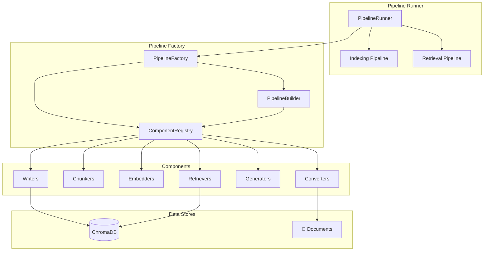
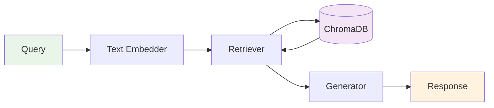
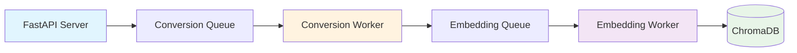
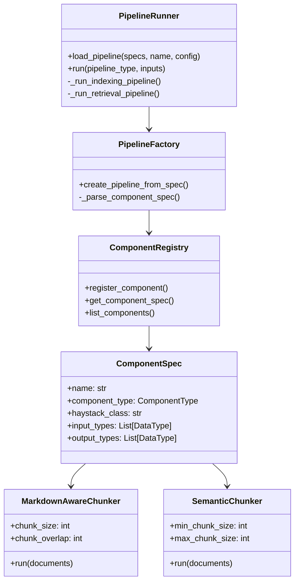

# Agentic RAG

A flexible, component-based RAG (Retrieval-Augmented Generation) pipeline system built on Haystack 2.0. Create powerful document processing and retrieval pipelines with minimal configuration.

## Architecture Overview



## Features

- **Component-based Architecture**: Modular pipeline components for converters, chunkers, embedders, retrievers, and generators
- **Custom Components**: Built-in markdown-aware and semantic chunkers optimized for structured documents
- **Automatic Document Store Integration**: ChromaDB integration with local persistence and shared datastores
- **Type-safe Configuration**: Strongly typed component specifications and configurations
- **Factory Pattern**: Dynamic pipeline creation from simple specifications
- **Runtime Parameter Support**: Override component parameters at execution time
- **End-to-end Workflows**: Complete indexing, retrieval, and generation pipelines
- **Optional Ingestion Server**: FastAPI-based server with GPU-aware batch processing for scalable document ingestion

## Quick Start

### Installation

```bash
# Basic installation
pip install -e .

# Installation with API server support (optional)
pip install -e ".[api]"
```

## 📊 Pipeline Flow

### Indexing Pipeline


### Retrieval Pipeline


### Basic Usage

```python
from agentic_rag import PipelineRunner

# Initialize the runner
runner = PipelineRunner()

# Create an indexing pipeline
indexing_spec = [
    {"type": "CONVERTER.TEXT"},
    {"type": "CHUNKER.MARKDOWN_AWARE"},
    {"type": "EMBEDDER.SENTENCE_TRANSFORMERS_DOC"},
    {"type": "WRITER.DOCUMENT_WRITER"}
]

# Load the pipeline
runner.load_pipeline(indexing_spec, "my_indexing_pipeline")

# Index documents
from haystack import Document
documents = [
    Document(content="# AI Overview\n\nArtificial Intelligence is transforming industries...")
]

results = runner.run("indexing", {"documents": documents})
print(f"Indexed {results['processed_count']} documents")
```

## Available Components

### Converters
- **`CONVERTER.PDF`** - Standard PDF text extraction
- **`CONVERTER.MARKER_PDF`** - Enhanced PDF extraction with Marker (better for academic papers)
- **`CONVERTER.DOCX`** - Microsoft Word document processing
- **`CONVERTER.HTML`** - HTML document processing
- **`CONVERTER.TEXT`** - Plain text processing

### Chunkers
- **`CHUNKER.DOCUMENT_SPLITTER`** - Standard recursive text splitting
- **`CHUNKER.MARKDOWN_AWARE`** - Preserves markdown structure and headers
- **`CHUNKER.SEMANTIC`** - Semantic boundary-aware splitting (headers, lists, code blocks)

### Embedders
- **`EMBEDDER.SENTENCE_TRANSFORMERS`** - Text embedding for queries
- **`EMBEDDER.SENTENCE_TRANSFORMERS_DOC`** - Document embedding for indexing

### Retrievers
- **`RETRIEVER.CHROMA_EMBEDDING`** - Vector similarity search with ChromaDB

### Generators
- **`GENERATOR.OPENAI`** - OpenAI GPT-based text generation

### Writers
- **`WRITER.DOCUMENT_WRITER`** - Stores documents in ChromaDB with persistence

## Retrieval Example

```python
# Create retrieval pipeline
retrieval_spec = [
    {"type": "EMBEDDER.SENTENCE_TRANSFORMERS"},
    {"type": "RETRIEVER.CHROMA_EMBEDDING"}
]

runner.load_pipeline(retrieval_spec, "my_retrieval_pipeline")

# Search documents with runtime parameters
results = runner.run("retrieval", {
    "query": "What is artificial intelligence?",
    "top_k": 3,  # Return top 3 results
    "filters": {"category": {"$eq": "ai"}}  # Filter by metadata
})

print(f"Found {len(results['results'])} relevant documents")
```

## Configuration

```python
config = {
    "markdown_aware_chunker": {
        "chunk_size": 1000,
        "chunk_overlap": 100
    },
    "document_embedder": {
        "model": "sentence-transformers/all-MiniLM-L6-v2"
    },
    "document_writer": {
        "root_dir": "./my_data"  # Custom ChromaDB location
    }
}

runner.load_pipeline(indexing_spec, "configured_pipeline", config)
```

## End-to-End RAG Workflow

```python
from agentic_rag import PipelineRunner
from haystack import Document

# Step 1: Index documents
indexing_runner = PipelineRunner()
indexing_spec = [
    {"type": "CHUNKER.MARKDOWN_AWARE"},
    {"type": "EMBEDDER.SENTENCE_TRANSFORMERS_DOC"},
    {"type": "WRITER.DOCUMENT_WRITER"}
]

config = {
    "document_writer": {"root_dir": "./shared_db"},
    "document_embedder": {"model": "sentence-transformers/all-MiniLM-L6-v2"}
}

indexing_runner.load_pipeline(indexing_spec, "indexing", config)

# Index your documents
documents = [
    Document(content="# Machine Learning\n\nML is a subset of AI...", meta={"topic": "ai"}),
    Document(content="# Python Programming\n\nPython is versatile...", meta={"topic": "programming"})
]

indexing_results = indexing_runner.run("indexing", {"documents": documents})
print(f"Indexed {indexing_results['processed_count']} documents")

# Step 2: Search and retrieve
retrieval_runner = PipelineRunner()
retrieval_spec = [
    {"type": "EMBEDDER.SENTENCE_TRANSFORMERS"},
    {"type": "RETRIEVER.CHROMA_EMBEDDING"}
]

retrieval_config = {
    "chroma_embedding_retriever": {"root_dir": "./shared_db"},  # Same DB
    "embedder": {"model": "sentence-transformers/all-MiniLM-L6-v2"}
}

retrieval_runner.load_pipeline(retrieval_spec, "retrieval", retrieval_config)

# Query the indexed documents
query_results = retrieval_runner.run("retrieval", {
    "query": "machine learning algorithms",
    "top_k": 5
})

print(f"🔍 Found {len(query_results['results'])} relevant documents")
```

## 🚀 Ingestion Server (Optional)

An optional FastAPI-based ingestion server provides a scalable API for document processing with GPU-aware batch processing capabilities.

### Installation

Install with the `[api]` extra to enable server functionality:

```bash
pip install -e ".[api]"
```

This installs additional dependencies:
- FastAPI for the REST API
- Uvicorn as the ASGI server
- python-multipart for file upload support

### Starting the Server

Use the CLI command to start the ingestion server:

```bash
agentic-rag-server
```

The server will:
- Start on `http://0.0.0.0:8000`
- Initialize background worker processes for conversion and embedding
- Apply dynamic batching for efficient GPU utilization

### API Endpoints

**Health Check**
```bash
curl http://localhost:8000/health
```

**Ingest PDF Documents**
```bash
curl -X POST http://localhost:8000/api/v1/ingest-papers \
  -F "pdf_files=@document1.pdf" \
  -F "pdf_files=@document2.pdf" \
  -F 'haystack_components={"converter": "MARKER", "chunker": "MARKDOWN_AWARE", "embedder": "SENTENCE_TRANSFORMERS_DOC", "writer": "DOCUMENT_WRITER"}'
```

### Demo Scripts

Test the ingestion server with the provided demos:

#### Basic API Demo
```bash
# Terminal 1: Start the server
agentic-rag-server

# Terminal 2: Run the demo (wait a few seconds after starting server)
poetry run python agentic_rag/ingestion/demos/demo_api_endpoint.py
```

The demo script:
- Creates mock PDF files with various page counts
- Sends them to the ingestion endpoint
- Configures a Haystack pipeline (Marker converter, chunker, embedder, writer)
- Monitors background processing

#### GPU Concurrency Demos

Three demonstration scripts prove the GPU-aware concurrency system works correctly:

**Case 1: Sequential Batching - Conversion Worker**
```bash
poetry run python agentic_rag/ingestion/demos/demo_case1_sequential_batching.py
```
Demonstrates page-based dynamic batching where documents are accumulated until the page limit is reached.

**Case 2: Token-Based Batching - Embedding Worker (No Converter)**
```bash
poetry run python agentic_rag/ingestion/demos/demo_case2_token_batching.py
```
Demonstrates token-based batching in the embedding worker with a pipeline that skips the converter stage.

**Case 3: Wait Time Behavior**
```bash
poetry run python agentic_rag/ingestion/demos/demo_case3_wait_time.py
```
Demonstrates how wait_time prevents indefinite waiting by processing partial batches when the queue remains empty.

**Pre-saved Results**: Server log snippets showing successful GPU concurrency behavior are available in `agentic_rag/ingestion/demos/log_examples/`:
- `case1_sequential_batching_server.txt` - Page-based batching logs
- `case2_token_batching_server.txt` - Token-based batching logs (no converter)
- `case3_wait_time_server.txt` - Wait time behavior logs

### Configuration

Configure the server via environment variables (prefix: `AGENTIC_RAG_`):

```bash
# Conversion worker settings
export AGENTIC_RAG_CONVERSION_BATCH_PAGE_LIMIT=100
export AGENTIC_RAG_CONVERSION_WORKER_POOL_SIZE=4
export AGENTIC_RAG_CONVERSION_BATCH_WAIT_TIME=0.1

# Embedding worker settings
export AGENTIC_RAG_EMBEDDING_BATCH_TOKEN_LIMIT=10000
export AGENTIC_RAG_EMBEDDING_BATCH_WAIT_TIME=0.01

agentic-rag-server
```

### Architecture

The ingestion server uses a multi-process architecture for efficient document processing:



**Key Features:**
- **Pipeline Parallelism**: Embedding worker processes batch N while conversion worker processes batch N+1
- **Dynamic Batching**: Page-based batching for conversion, token-based batching for embedding
- **Process Isolation**: Separate worker processes for conversion and embedding stages
- **Fire-and-forget**: Returns immediately after enqueuing documents (async processing)

### Documentation

For detailed implementation information, see:
- `agentic_rag/ingestion/docs/IMPLEMENTATION_PLAN.md` - Architecture and design
- `agentic_rag/ingestion/docs/ASSUMPTIONS.md` - Implementation constraints and guidelines

## 🗄️ Document Store Integration

ChromaDB is automatically initialized with local persistence:
- **Default path**: `./chroma/` (relative to current directory)
- **Configurable**: Set `root_dir` in component config
- **Shared storage**: Same `root_dir` = shared datastore across pipelines
- **Automatic creation**: Directories created automatically if they don't exist

## 🔧 Component Architecture



## 🧪 Development

```bash
# Install dependencies
poetry install

# Run all tests
make test

# Run specific test categories
poetry run pytest tests/test_pipeline_runner_integration.py -v  # Integration tests
poetry run pytest tests/components/ -v                          # Component tests

# Type checking
make type-check

# Linting and formatting
make lint
make format
```

### Project Structure

```
agentic_rag/
├── components/           # Component implementations
│   ├── chunkers/        # Custom chunking components
│   ├── converters/      # Document conversion components
│   └── registry.py      # Component registry
├── pipeline/            # Pipeline orchestration
│   ├── builder.py       # Pipeline construction
│   ├── factory.py       # Pipeline creation from specs
│   └── runner.py        # Pipeline execution
├── ingestion/           # Optional ingestion server (requires [api] extra)
│   ├── api/            # FastAPI application and models
│   │   ├── app.py      # Main FastAPI app with endpoints
│   │   ├── models.py   # Pydantic request/response models
│   │   └── mocks/      # Mock components for testing
│   ├── core/           # Worker processes and queues
│   │   ├── pipeline_queues.py    # Multiprocessing queues
│   │   ├── converter_worker.py   # Conversion worker with batching
│   │   └── embedder_worker.py    # Embedding worker with batching
│   ├── demos/          # Demo scripts
│   │   └── demo_api_endpoint.py  # Test script for API
│   ├── docs/           # Server documentation
│   │   ├── IMPLEMENTATION_PLAN.md
│   │   └── ASSUMPTIONS.md
│   └── cli.py          # CLI entry point (agentic-rag-server)
└── types/               # Type definitions
    ├── component_spec.py
    ├── pipeline_spec.py
    └── data_types.py
```

### Adding Custom Components

1. **Create your component** following Haystack 2.0 patterns:
```python
from haystack import component, Document

@component
class MyCustomChunker:
    def __init__(self, chunk_size: int = 1000):
        self.chunk_size = chunk_size

    @component.output_types(documents=List[Document])
    def run(self, documents: List[Document]) -> Dict[str, List[Document]]:
        # Your chunking logic here
        return {"documents": chunked_docs}
```

2. **Register in ComponentRegistry**:
```python
self.register_component(
    ComponentSpec(
        name="my_custom_chunker",
        component_type=ComponentType.CHUNKER,
        haystack_class="your_module.MyCustomChunker",
        input_types=[DataType.LIST_DOCUMENT],
        output_types=[DataType.LIST_DOCUMENT],
        default_config={"chunk_size": 1000}
    )
)
```

3. **Add to component enums** in `types/component_enums.py`

## 🤝 Contributing

1. Fork the repository
2. Create a feature branch: `git checkout -b feature/amazing-feature`
3. Make your changes and add tests
4. Run the test suite: `make test`
5. Commit your changes: `git commit -m 'Add amazing feature'`
6. Push to the branch: `git push origin feature/amazing-feature`
7. Open a Pull Request

## 📄 License

MIT License - see [LICENSE](LICENSE) file for details

## 🙏 Acknowledgments

- Built on [Haystack 2.0](https://haystack.deepset.ai/) by deepset
- Uses [ChromaDB](https://www.trychroma.com/) for vector storage
- Integrates [SentenceTransformers](https://www.sbert.net/) for embeddings
